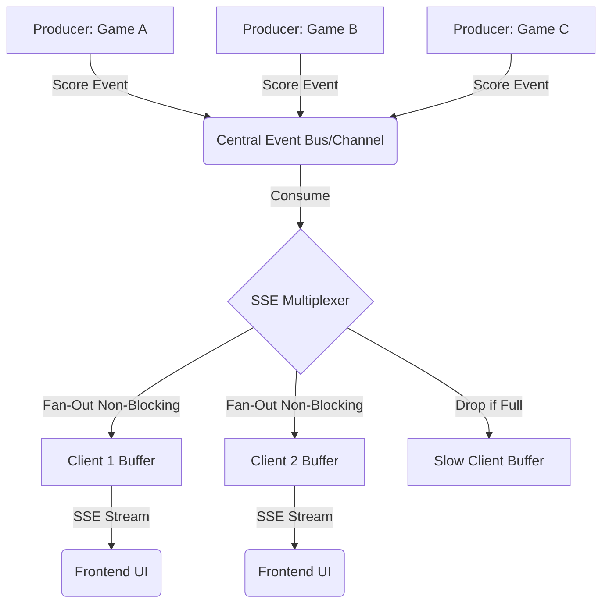

# Real-Time SSE Sports Score Feed Multiplexer

A high-performance, real-time sports score feed aggregator using Server-Sent Events (SSE). This service efficiently distributes live game updates to thousands of concurrent web clients using a fan-out multiplexing pattern.

## Architecture & Data Flow

The backend is built in **Go**, utilizing channels and goroutines for multiplexed, non-blocking streams.



## Core Mechanisms & Edge Case Handling

- **Backpressure Handling:** Fanning out events uses a non-blocking channel send (`select { case ch <- evt: default: drop() }`). If a client's buffer is full, the event is safely dropped, preventing the slow client from halting the global stream.
- **Strict Time-Based History & Replay:** The server strictly retains exactly the last 5 minutes of events in memory. 
- **Replay Edge Cases:** 
  - If a client reconnects with a `Last-Event-ID` that *exists* in the 5-minute history, the server immediately streams the exact missed events before resuming the live feed.
  - If the `Last-Event-ID` is *too old* (no longer in history) or invalid, the server employs a safe fallback: it treats the connection as fresh and immediately dispatches the `initial_state` to prevent the client from being stuck with stale UI data.
- **Heartbeats:** To keep idle connections alive through strict proxies, an SSE comment (`: ping`) is emitted every 15 seconds.
- **Sliding-Window EPS:** The `/stats` endpoint calculates Events Per Second (EPS) dynamically based on a rolling 10-second window, providing accurate near-real-time throughput metrics rather than a static lifetime average.

## Requirement Verification Checklist

- [x] **Docker Compose + Healthcheck:** `docker-compose.yml` with `app` service and `/stats` healthcheck.
- [x] **.env.example:** Present with `PORT` placeholder.
- [x] **SSE Headers:** `/events` endpoint sets `text/event-stream`, `no-cache`, `keep-alive`.
- [x] **SSE Message Format:** Formatted strictly with `id`, `event: score_update`, and JSON payload.
- [x] **Game Subscription Filter:** Supports `?games=g1,g2` query filtering.
- [x] **15s Heartbeat:** Dispatches `: ping\n` every 15 seconds.
- [x] **Stats Schema:** Exposes `connected_clients`, real-time `events_per_second`, `total_dropped_events`, and `active_games`.
- [x] **Initial State on Connect:** Sends `initial_state` strictly before the live stream begins.
- [x] **Last-Event-ID Replay:** Reliably streams missed events. Skips `initial_state` on successful replay to ensure exact ordering.
- [x] **Slow-client Handling:** Non-blocking fan-out gracefully drops events and increments metrics.
- [x] **Frontend Data-TestIDs:** UI elements strictly map to required data attributes for headless testing.
- [x] **Real-Time UI Updates:** JavaScript dynamic DOM manipulation on event arrival.
- [x] **Connection Status Indicator:** Natively tracks `connected`, `reconnecting` (via `EventSource.CONNECTING` check), and `disconnected` states.

## Run Instructions

The entire stack is containerized using Docker and Docker Compose. To start the application:

```bash
docker-compose up -d --build
```

Wait approximately 10 seconds for the health checks to pass. The application will be available at:
- **Dashboard:** [http://localhost:8080](http://localhost:8080)
- **Stats API:** [http://localhost:8080/stats](http://localhost:8080/stats)

## Testing

Comprehensive unit and integration tests are included in the `server` directory. The test suite spins up a mock `httptest.Server` and rigorously verifies SSE endpoint headers, subscription filtering, initial state dispatch, fallback behavior, and Last-Event-ID replay ordering logic.

To run the tests locally:
```bash
cd server
go test -v ./...
```
